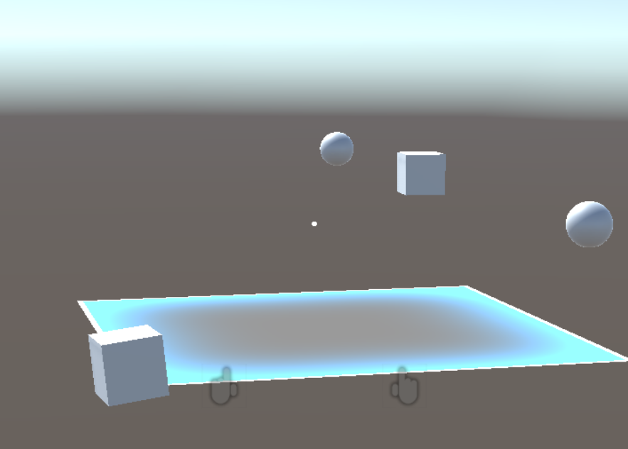

# HololensVocalCommands
A simple implementation of some vocal commands for the Microsoft HoloLens using the [HoloToolkit](https://github.com/Microsoft/MixedRealityToolkit-Unity) framework.

## Environments used for developing
* Unity 2017.4.1f1 (64bit)
* HoloToolkit 2017.4.2.0

## List of Vocal Commands
* "Create cube" (shortcut C) 
Create a cube in the direction in which the user is pointing the cursor.
* "Create sphere" (shortcut V) 
Create a sphere in the direction in which the user is pointing the cursor.
* "Delete objects" (shortcut B) 
Delete all the objects in the scene.

Please refer to the [official documentation](https://docs.microsoft.com/en-us/windows/mixed-reality/holograms-100) for deploying or testing on an emulator.
